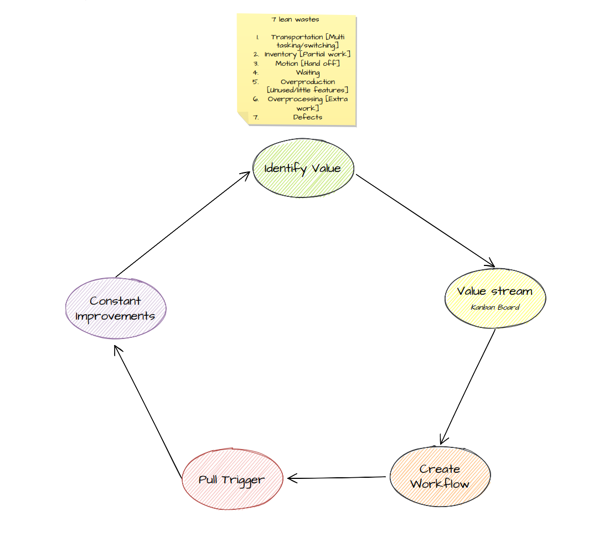
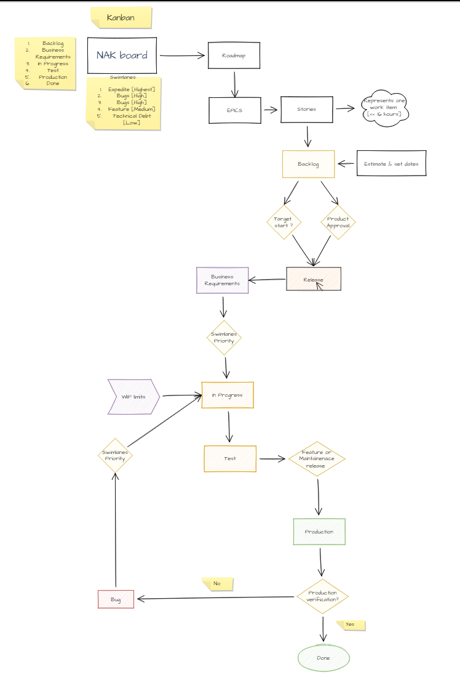

# Nakshatra

Nakshatra (Sanskrit: नक्षत्र,) is the traditional constellation of stars in the sky as per ancient Indian Astronomy. A nakshatra is one of 27 sectors along the ecliptic. Their names are related to a prominent star or asterisms in or near the respective sectors. This repository is suite of products which I have created for my use to begin with and later to expand for general utility. 

# Contents
- [Overview](#overview)
- [Modules](#module)
- [Project Management](#management)
- [Contribute](#contribute)
- [Code of Conduct](#conduct)
- [Contact](#contact)

## Overview 
Below is the current architecture of the Nakshtra project. Its evolving and I would keep updating it.

## Modules 
  * Website - [amitdole.com](https://github.com/amitdole/nakshatra/blob/master/Web/README.md): My personal website
  * Web Api - [surya web api](https://github.com/amitdole/nakshatra/blob/master/WebApi/README.md): Web Api suite

## Project Management 
- **Summary**\
\
  Nakshatra project is my personal project where I define the requirements based on how I want to evaluate this product and then plan and execute it. I decided to go with Kanban agile methodology as it fir into my requirements due to below:

  Its a Pull system supporting work Just in time, allowing me to pull in the task when I want to work on or is required.

  Kanban boards are more flexible with regards to tasks and timing.

  Deliver work items much faster, with increase and improvement in productivity and flow efficiency.

  Kanban supports ongoing process.
  
  
- **Lean Management**\
\
   I implement below 5 principles of lean as follows:
   * Identify Value
       * The value is to provide a portal for all things I have been doing and do. Also to create services which I want but not necessarily available as is out of box.

   * Value Stream
       * I use Jira Kanban board to visualize the stream of tasks to be done.

   * Create WorkFlow
       * Using Kanban board & Swimlanes and applying WIP limits I have set a workflow where 3 tasks in progress have been limited to 3.

   * Pull Trigger
       * My needs & available capacity is the trigger for Pull from backlog to WIP. I track it using:
          * Cycle time
          * Throughput
          
    * Constant Improvement
       * I use PDCA-plan-do-check-act as repetitive four-stage model for continuous improvements.
       
      
- **Workflow**
  
     

- **Release Management**
    Nakshatra would have 2 releases per month.

    1. Feature release [1st day of month]
    2. Maintenance release [1st day of 3 week of month]

    In Jira → Release versions would be created for the scheduled releases for the year using versions. 

    The format of release number would be YYYY.MM.{number}. e.g. - 2022.05/ 2022.05.01. Feature release wont have {number} suffix.
    
    As part of planning & work scheduling cards would be moved to a release version. 
- **Planning & Work Scheduling**
  1. I use the Kanban Roadmap Gantt Chart to define the project timelines based on Epics.
  2. For the task in current release or backlog ready for WIP add estimates to each card.
  3. For backlog item set Target start & Target end.
  4. Once card is selected for WIP set Start date & Due date.
  5. Based on #ii & #iii task can be scheduled or moved out of release.

After release goes to production it is closed and cards if any which did not went into production goes either to backlog or release.
- **Version Control**
  I am using Git Repository for Version Control. I have also integrated Git Repository to Jira to link Kanban cards.

## Contribute 
- To contribute raise a pull request to this repository or open an issue.
- Please provide details as required by that section with referenecs.

## Code of Conduct 
The purpose of this repository is to add new utilities and features which help in increasing productivity and solve common problems. Along this journey as we learn along and add to our knowledge and contribute.

## Contact 
Feel free to contact me directly via [LinkedIn](https://www.linkedin.com/in/amit-dole-41a3b420).
